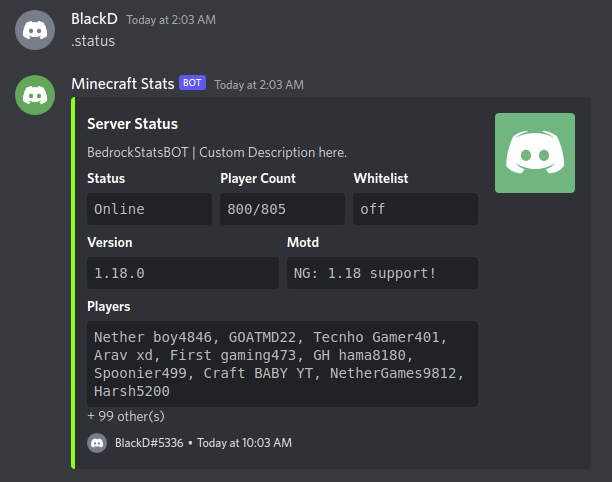
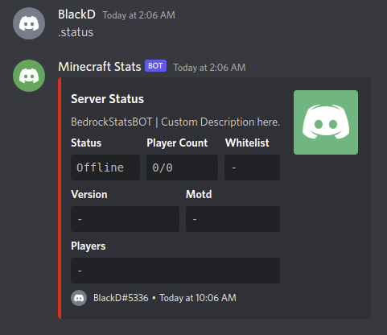

### HOW TO USE?
- Clone This Repository
```bash
git clone https://github.com/BlackD14/BedrockStatsBOT
```
- Install discord.py & python-dotenv module
```bash
pip3 install discord.py python-dotenv
```
- Edit ``.env`` file
```bash
# BOT INFORMATION
TOKEN=YOUT_DISCORD_BOT_TOKEN
PREFIX=YOUR_PREFIX

# SERVER IP & PORT
IP=play.nethe4rgames.org
PORT=19132

# MAX PLAYER NAME SHOWING
MAX_SHOW=10

# LEAVE BLANK WHEN NOT IN USE | THUMBNAIL=
THUMBNAIL=https://cdn.discordapp.com/attachments/922551795090350110/971798713704009728/2.png
DESCRIPTION=BedrockStatsBOT | Custom Description Here.
```
- Run BedrockStatsBOT
```bash
python3 app.py
```
<br><br>
<p align="center"><strong>Online & Offline Message</strong></p>

---
<p align="center">


</p>
